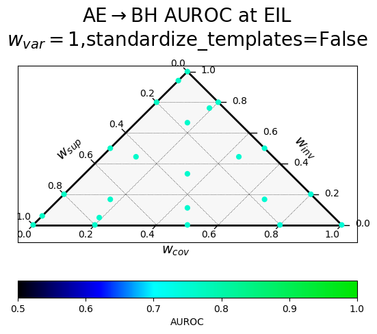
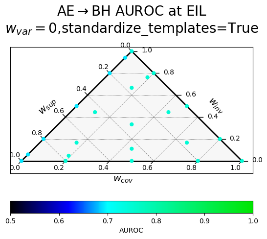
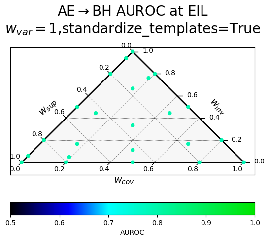

In Spring 2023, a team at EleutherAI and elsewhere worked on a follow-up to [CCS](https://arxiv.org/abs/2212.03827) that aimed to improve its robustness, among other goals. We think the empirical side of the project was largely unsuccessful, failing to provide evidence that any method had predictably better generalization properties. In the spirit of transparency, we are sharing our proposed method and some results on the [Quirky Models benchmark](https://arxiv.org/abs/2312.01037).

# Introduction

As we rely more and more on large language models (LLMs) to automate cognitive labor, it's increasingly important that we can trust them to be [truthful](https://arxiv.org/abs/2110.06674). Unfortunately, LLMs often reproduce human errors and misconceptions, even when their advanced capabilities suggest that they "know better" ([TruthfulQA](https://arxiv.org/abs/2109.07958)). More worryingly, when powerful models are trained to generate text that humans rate highly, they may learn to output nice-sounding just-so stories that humans can't distinguish from the truth.

Motivated by these concerns, [Christiano et al. 2021](https://docs.google.com/document/d/1WwsnJQstPq91_Yh-Ch2XRL8H_EpsnjrC1dwZXR37PC8/edit#heading=h.kkaua0hwmp1d) introduce *Eliciting Latent Knowledge* (ELK), the problem of constructing a reliable method for eliciting the information that intuitively *must* be contained inside highly capable AI systems&mdash;even when the AI is incentivized to conceal it from us. Solving ELK would allow us to detect deceptive models before they get out of hand, and would make it much easier to provide a reliable feedback signal for systems with greater than human intelligence.

## Contrast Consistent Search (CCS)

[Burns et al., 2022](https://arxiv.org/abs/2212.03827) introduced CCS, an unsupervised method that identifies a direction in the activation space that ensures that a given statement and its negation are assigned complementary probabilities.

Initially, a language model $\mathcal{M}$ computes contextualized embeddings ${(\mathcal{M}(s_i^+), \mathcal{M}(s_i^-))}$ for a dataset containing textual contrast pairs ${(s_i^+, s_i^-)}_{i=1}^{n}$. Subsequently, a linear probe is trained to output probabilities for given embeddings. The probe serves to determine the probabilities ${p^+}$ and ${p^-}$, which represent the truth values of ${s_i^+}$ and ${s_i^-}$. The training objective for the probe is formulated as follows:

$$
L_{\text{CCS}}(\theta,b;q_{i}):=\left[p_{\theta,b}(s_{i}^{+})-(1-p_{\theta,b}(s_{i}^{-}))\right]^{2} + \min\{p_{\theta,b}(s_{i}^{+}),p_{\theta,b}(s_{i}^{-})\}^{2} 
$$

The first term is motivated by the consistency structure of truth, specifically by the fact that the probabilities of a statement and its negation sum up to one. The second term aims to prevent a degenerate solution where the probabilities of both true and false are equal, $p(s^{+})=p(s^{-})=0.5$. The second term therefore increases the confidence of the model.

While the CCS method has demonstrated promising results for discovering truth directions in pre-trained language models, its effectiveness can be highly variable across different runs, datasets, and models. As a result, it may require many trials to obtain a probe with relatively high performance.

# Variance, Invariance, Negative Covariance, and Supervision (VINC-S)

We start with the Contrastive Representation Clustering&mdash;Top Principal Component (CRC-TPC) method introduced in [Burns et al., 2022](https://arxiv.org/abs/2212.03827). Given a dataset of textual contrast pairs $\{(s_i^+, s_i^-)\}_{i=1}^{n}$, we use a language model $\mathcal{M}$ to compute contextualized embeddings $\{(\mathcal{M}(s_i^+), \mathcal{M}(s_i^-))\}$. We also need to choose a layer $\ell$ and a token position $t$ from which to extract the embeddings. In this section we suppress these details for readability. CRC-TPC then computes the top principal component of their vector differences:

$$
\begin{equation}
    \mathbf{w^*} = \mathrm{TPC}(\{\mathcal{M}(s_i^+) - \mathcal{M}(s_i^-)\})
\end{equation}
$$

We then use the dot product $\langle\mathcal{M}(s_i), \mathbf{w^*}\rangle$ to generate a score for a statement $s_i$. We can use labels to resolve the sign ambiguity of PCA, choosing the orientation of $\mathbf{w^*}$ which maximizes accuracy on the training set.

## PCA on contrast pairs implies negation-consistency

At first CRC-TPC may appear theoretically unmotivated, since there is no obvious reason why the top principal component of the contrastive representations should track truth. For this reason, [Burns et al., 2022](https://arxiv.org/abs/2212.03827) recommend a different algorithm, Contrast Consistent Search (CCS), which explicitly optimizes a linear probe to minimize a logical consistency loss.

Here we show that CRC-TPC is better motivated than it first appears. Recall that the top principal component $\mathbf{w^*}$ of a data matrix $X \in \mathbb{R}^{n \times d}$ is the direction of maximal variance in $X$. Formally, it is the solution to the constrained optimization problem:
$$
\begin{equation}
    \mathbf{w^*} = \mathop{\mathrm{argmax\:}}_{\substack{\\[1pt]||\mathbf{w}||_2\,=\,1}}\:\mathbf{w}^{T}\mathrm{Cov}(X) \mathbf{w},
\end{equation}
$$
where $\mathrm{Cov}(X)$ is the covariance matrix of $X$. By Equation 1, we can view $X$ as the *difference* between two data matrices, $X^{+}$ and $X^{-}$, corresponding to the positive and negative elements of the contrast pairs respectively. Now recall the familiar identity that, for scalar random variables $A$ and $B$,
$$
\begin{equation}
    \mathrm{Var}(A - B) = \mathrm{Var}(A) + \mathrm{Var}(B)\:-\:2\:\mathrm{Cov}(A, B).
\end{equation}
$$
We can apply the vector analogue of this identity to rewrite Equation 2 as
$$
\begin{equation}
\begin{aligned}
    \mathbf{w^*} = \mathop{\mathrm{argmax\:}}_{\substack{\\[1pt]||\mathbf{w}||_2\,=\,1}} &\mathbf{w}^{T} [\mathrm{Cov}(X^{+}) + \mathrm{Cov}(X^{-})] \mathbf{w} &&- \mathbf{w}^{T} [\mathrm{Cov}(X^{+}, X^{-}) + \mathrm{Cov}(X^{-}, X^{+})] \mathbf{w}\\
    &=\mathbf{w}^{T} A_{\mathrm{confidence}} \mathbf{w} &&- \mathbf{w}^{T} A_{\mathrm{consistency}} \mathbf{w}
\end{aligned}
\end{equation}
$$
where $\mathrm{Cov}(X^{+}, X^{-})$ denotes the cross-covariance matrix of $X^{+}$ and $X^{-}$.

From Equation 4, we see that CRC-TPC implicitly searches for a direction along which $\mathcal{M}(s_i^+)$ and $\mathcal{M}(s_i^-)$ are *negatively correlated* (and high variance): if the credence assigned to $x_i^+$ is high, the credence assigned to $x_i^-$ should be low, and vice versa. Intuitively, negation consistency is a kind of negative correlation: a logically consistent person who confidently asserts a proposition $P$ should be unlikely to confidently assert $\neg P$, and vice versa. So the negative covariance term in Equation 4 can be viewed as encouraging negation consistency.

## Paraphrase Invariance

Another intuitive property of truth is *paraphrase invariance*: if a logically consistent person assigns a credence $C$ to a statement $s$, they should assign roughly the same credence to all statements with a similar meaning to $s$. We view paraphrases as a kind of data augmentation which changes the surface form of a statement while preserving its truth value, just as data augmentations in computer vision change the appearance of an image while preserving its class. [Recent work](https://arxiv.org/abs/2203.03304) has found that *explicitly* regularizing a classifier's predictions to be invariant to data augmentations can improve performance in supervised learning as well as the [semi-supervised setting](https://arxiv.org/abs/1904.12848), and we hypothesize that it should improve ELK performance as well.

### Clusters
We'll call a set of statements with nearly identical meanings a *cluster*. Consider a dataset of $n$ clusters, each of size $k$. Then $s_{ij}^+$ denotes the $j^\text{th}$ paraphrase of the $i^\text{th} $ proposition in the dataset, and $s_{ij}^-$ is its negation. For each cluster $\{(s_{ij}^+, s_{ij}^-)\}_{j=1}^{k}$, we'll write $X_{i}^{+} \in \mathbb{R}^{k \times d}$ to denote the data matrix containing the embeddings of the $k$ paraphrases of $s_i^+$, and $X_{i}^{-}$ will contain the paraphrases of the negation $s_i^-$. We can then define the invariance to be the negative mean variance in credences within each cluster:

$$
\begin{equation}
\begin{aligned}
    \mathcal{L}_{\mathrm{invariance}}(\mathbf{w}) &= -\frac{1}{n} \sum_{i=1}^{n} \mathbf{w}^T \mathrm{Cov}(X_{i}^+)\mathbf{w} - \frac{1}{n} \sum_{i=1}^{n} \mathbf{w}^T \mathrm{Cov}(X_{i}^-)\mathbf{w}\\
    &= \mathbf{w}^T \Big [ -\frac{1}{n} \sum_{i=1}^{n} \mathrm{Cov}(X_{i}^+) - \frac{1}{n} \sum_{i=1}^{n} \mathrm{Cov}(X_{i}^-) \Big ] \mathbf{w}\\
    &= \mathbf{w}^T A_{\mathrm{invariance}} \mathbf{w}.
\end{aligned}
\end{equation}
$$

This loss function is zero just in case for each cluster $i$, credences are identical for all paraphrases in $i$.

### Centroids
In order to adapt the confidence and consistency terms to this new framework, we'll need to introduce the concept of a cluster *centroid*, or the average representation of the statements in a given cluster:
$$
\begin{equation}
    \boldsymbol{\bar x}_{i}^+ = \frac{1}{k} \sum_{j=1}^k \mathcal{M}({s}_{ij}^+), \quad \boldsymbol{\bar x}_{i}^- = \frac{1}{k} \sum_{j=1}^k \mathcal{M}({s}^-_{ij})
\end{equation}
$$
We'll stack all the centroids for the positive and negative statements in a dataset into data matrices $\bar X^{+}, \bar X^{-} \in \mathbb R^{n \times d}$ respectively. Then we define $A_{\mathrm{variance}}$ and $A_{\mathrm{covariance}}$ as in Equation 4, using $\bar X^{+}$ and $\bar X^{-}$ in place of $X^{+}$ and $X^{-}$.

## Incorporating supervision
We can modify the objective to incorporate supervision by encouraging variance between the mean hidden state of true and false examples.
$$
\begin{align}
   \mathcal{L_\text{supervised}} = \mathbf{w}^T \mathrm{Cov}(\begin{bmatrix} \boldsymbol{\bar x}_T & \boldsymbol{\bar x}_F\end{bmatrix}) \mathbf{w} &= \mathbf{w}^T A_\text{supervised} \mathbf{w}
\end{align}
$$
where
$$
\begin{align*}
    \boldsymbol{\bar x}_T &= \mathbb{E}[\mathcal{M}(s)|s\text{ is true}]\\
    \boldsymbol{\bar x}_F &= \mathbb{E}[\mathcal{M}(s)|s\text{ is false}].
\end{align*}
$$
$A_\text{supervision}$ is a rank-1 covariance matrix of this data matrix containing only two samples. Its top eigenvector is proportional to the difference-in-class-conditional-means direction, which prior work has found to have desirable generalization properties ([Marks et al., 2023](https://arxiv.org/abs/2310.06824); [Mallen et al., 2023](https://arxiv.org/abs/2312.01037); [Zou et al., 2023](https://arxiv.org/abs/2310.01405); [Belrose, 2023](https://blog.eleuther.ai/diff-in-means/)).

## Putting it together
We apply the CRC-TPC loss function from Equation 4 to the centroids and add $\mathcal{L}_{\mathrm{invariance}}$ and $\mathcal{L_\text{supervised}}$, yielding the VINCS loss formula:

$$
\begin{equation}
\begin{aligned}
    \mathcal{L}_{\mathrm{VINCS}}(\mathbf{w}) &= \alpha\:\mathbf{w}^{T} A_{\mathrm{conf}} \mathbf{w} &&+
    \beta\:\mathbf{w}^{T} A_{\mathrm{inv}} \mathbf{w} &&&+\:
    \gamma\:\mathbf{w}^{T} A_{\mathrm{cons}} \mathbf{w} &&&&+\: \sigma\:\mathbf{w}^{T} A_{\mathrm{sup}} \mathbf{w}\\
    &= \mathbf{w}^{T} \Big [ \alpha\:A_{\mathrm{conf}} &&+
    \beta\:A_{\mathrm{inv}} &&&+\:
    \gamma\:A_{\mathrm{cons}} &&&&+\: \sigma\:A_{\mathrm{sup}}\Big ] \mathbf{w}\\
    &= \mathbf{w}^{T} A_{\mathrm{VINCS}} \mathbf{w},
\end{aligned}
\end{equation}
$$

where $\alpha$, $\beta$, $\gamma$, and $\sigma$ are scalar hyperparameters.

# Algorithm

Note that $\mathbf{A}_{\mathrm{VINCS}}$ in Equation 8 is a symmetric matrix, which means $\mathcal{L}_{\mathrm{VINCS}}$ is a quadratic form. We'll now show that this implies it can be optimized using eigendecomposition.

**Theorem 1.**
The global optimum of the $\mathcal{L}_{\mathrm{VINCS}}$ objective is the dominant eigenvector of $\mathbf{A}_{\mathrm{VINCS}}$.

*Proof.* Our proof mirrors the maximal variance derivation of principal component analysis found in [standard textbooks](https://www.microsoft.com/en-us/research/uploads/prod/2006/01/Bishop-Pattern-Recognition-and-Machine-Learning-2006.pdf).
$$
\begin{align*}
\text{Primal problem:} && \mathbf{w^*} &= \mathop{\mathrm{argmax\:}}_{\substack{\\[1pt]||\mathbf{w}||_2^2\,=\,1}} \mathbf{w}^T \mathbf{A}_{\mathrm{VINCS}} \mathbf{w} \\
\text{Define the Lagrangian:} && \mathcal{L}(\mathbf{w}, \lambda) &= \mathbf{w}^T \mathbf{A}_{\mathrm{VINCS}} \mathbf{w} - \lambda (\mathbf{w}^T \mathbf{w} - 1) \\
\text{Differentiate and set to zero:} && 0 &= 2\mathbf{A}_{\mathrm{VINCS}}\mathbf{w^*} - 2\lambda\mathbf{w^*} \\
\text{Rearrange:} && \lambda\mathbf{w^*} &= \mathbf{A}_{\mathrm{VINCS}}\mathbf{w^*}
\end{align*}
$$

This is the eigenvalue equation for $\mathbf{A}_{\mathrm{VINCS}}$, where $\lambda$ is an eigenvalue and $\mathbf{w^*}$ is the corresponding eigenvector. We've shown that the stationary points of the Lagrangian are precisely the eigenvectors of $\mathbf{A}_{\mathrm{VINCS}}$ and their associated eigenvalues. Note that since our primal problem is equivalent to maximizing the Rayleigh quotient $R(\mathbf{A}_{\mathrm{VINCS}}, \mathbf{w})$, this also follows from the Rayleigh-Ritz theorem. It follows that the global maximum is the eigenvector corresponding to the algebraically largest eigenvalue. Note that unlike a covariance matrix, $\mathbf{A}_{\mathrm{VINCS}}$ need not be positive semi-definite, and the leading eigenvalue may be negative. 

$\blacksquare$

Importantly, eigenvectors are only defined up to an arbitrary choice of sign. This means that without an additional constraint, we don't know how to *orient* $\mathbf{w^*}$ so that positive values of $\langle \mathbf{w^*}, \cdot \rangle$ correspond to true statements and negative values correspond to false statements.

### Implementation
Since we are only interested in the dominant eigenvector, we can use an algorithm like Lanczos iteration to find it efficiently without computing the full eigendecomposition of $\mathbf{A}_{\mathrm{VINCS}}$.

Furthermore, since $\mathbf{A}_{\mathrm{VINCS}}$ only depends on covariance statistics, it can be computed incrementally over a large dataset with $O(d^2)$ memory usage. We can also compute $\mathbf{A}_{\mathrm{VINCS}}$ over a data stream with covariance statistics that change over time, using exponential moving averages of sample covariance matrices. This would make it efficient for use during neural network training.

We also use [LEACE](https://arxiv.org/abs/2306.03819) to erase linear information about which element of the contrast pair an activation comes from, and information about which paraphrase was used.

# Results

Previous results have only been on standard QA benchmarks, which are not designed to test the ability of ELK methods to generalize to contexts where the model is untruthful, and to questions too difficult for our labelers to verify.

We present results on the [Quirky Models benchmark](https://arxiv.org/abs/2312.01037), which contains a set of 12 tasks and corresponding models which have been finetuned to make systematic errors conditional on the keyword "Bob", but answer truthfully conditional on the keyword "Alice". We then train probes on Alice's (truthful) contexts and evaluate the AUROC of the probes in Bob's (untruthful) contexts, for questions harder than those used for training. This "Alice-easy to Bob-hard" (AE $\to$ BH) transfer AUROC is our primary metric for evaluating the performance of an ELK method. One notable limitation of this benchmark is that the activations used in the contrast pairs for training the probes are out of distribution with respect to finetuning distribution of the model (they are the answer tokens of the model, not the final prompt input tokens). 

We first show results for probes trained on activations at the earliest informative layer (EIL), which is a heuristic proposed in [Mallen et al., 2023](https://arxiv.org/abs/2312.01037) for selecting the layer at which to probe. It is the earliest layer at which the in-distribution validation AUROC minus 0.5 is at 95% of its maximum. However, because there is not much variation in performance here, we also show aggregate results over all layers to better compare methods.

## Hyperparameter sweep
Results of a hyperparameter sweep shown in a ternary plot. Points marked with a heavy plus (+) are averaged results over all datasets, while the smaller points are results on individual datasets, whose position has been jittered slightly for visibility.

$w_{var}$ corresponds to $\alpha$ (confidence), $w_{inv}$ to $\beta$ (paraphrase invariance), $w_{cov}$ to $\gamma$ (negation consistency), and $w_{sup}$ to $\sigma$ (supervision).

Each row corresponds to a different way of producing the paraphrases, with "standardized" templates providing a uniform meta-template surrounding the diverse paraphrases.
### At the earliest informative layer (EIL)
|  |  |
|:------------------------------------------:|:------------------------------------------:|
| Without variance term, standardized templates | With variance term, standardized templates |

|  |  |
|:------------------------------------------:| :------------------------------------------:|
| Without variance term, random templates | With variance term, random templates |

### At all layers
|  |  |
|:------------------------------------------:|:------------------------------------------:|
| Without variance term, standardized templates | With variance term, standardized templates |

|  | 
|:------------------------------------------:| :------------------------------------------:|
| Without variance term, random templates | With variance term, random templates |

## Analysis

- All of the effect sizes are small and noisy

- Variance is an important criterion in this setup! We had originally suspected that variance wasn't useful because it's unprincipled.

- At EIL things are pretty overdetermined - all the ELK probe hyperparameters work well, as long as $w_{var}=1$

- When looking at all layers, we can see that the negation consistency term is harmful, though having a variance term helps guide the probe back in the right direction.

- Paraphrase invariance is useful

- The supervision term is somewhat useful, though it seems to be no better than, or perhaps marginally worse than, a variance term (comparing methods with only a paraphrase invariance term and a variance/supervision term).

- (Looking at standardized templates) The best hyperparameter settings (all the ones involving variance and no negation consistency; 0.648) don't significantly outperform the difference in means reporter ($w_{sup}=1$, everthing else 0 $\rightarrow$ 0.63 transfer AUROC) or the CRC reporter ($w_{cov}=w_{var}=0.5$ and everything else 0 $\rightarrow$ 0.611 transfer AUROC).

- [Burns et al. 2023](https://arxiv.org/abs/2312.09390) found paraphrase invariance to be unhelpful for eliciting latent knowledge in the weak-to-strong generalization setting, which is in conflict with our weak results. Additionally, the reason to expect paraphrase invariance to work better seems more likely to be true for future, more capable models, making it worth reinvestigating in the future.
